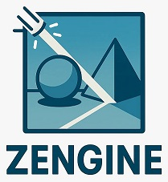

# Zengine

 

Zengine is a real-time ray tracing engine that constructs scenes by simulating light transport across various materials and geometric shapes based on their optical properties.

## Features

- Real-time ray tracing with progressive rendering
- Support for ~16 primitive shapes (2D and 3D)
- Material system with optical properties
- Quality presets for workflow optimization
- PPM image export
- Saving & loading scene

## Usage Tips

For optimal workflow with computationally intensive scenes:

1. **Use Fast Preview Mode** (`View → Render Quality`) while constructing your scene
   - Provides interactive performance at reduced quality
2. **Switch to Normal Quality** for final rendering
3. **Export high-quality renders** with Ctrl+P (saves as PPM format)
   - Automatically uses best quality settings

## Installation

### Prerequisites

- C++17
- CMake 3.12+
- SDL2
- GLM
- GLAD
- OpenGL 4.3+

### Setup 
```
git clone https://github.com/rumike7/Zengine.git
cd Zengine
mkdir build 
cd build 
cmake ..
cmake --build .
./zengine # or ./zengine.exe on Windows 
```